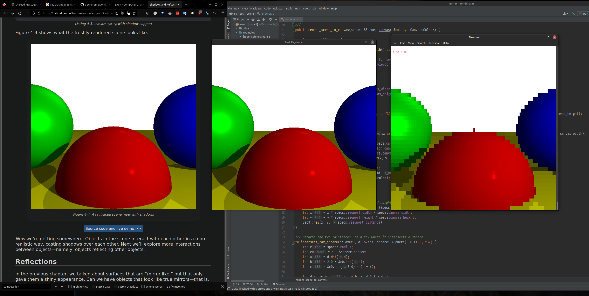

min-rt
===

Rudimentary, CPU-based raytracer written in Rust, using the pseudocode outlined in the book ["Computer Graphics from Scratch"](https://gabrielgambetta.com/computer-graphics-from-scratch/) by Gabriel Gambetta. 

Currently up to the section on specular highlights. Work in progress.

To run the examples, `cd` to one of the subdirectories in `/examples/`, and enter `cargo run`.

